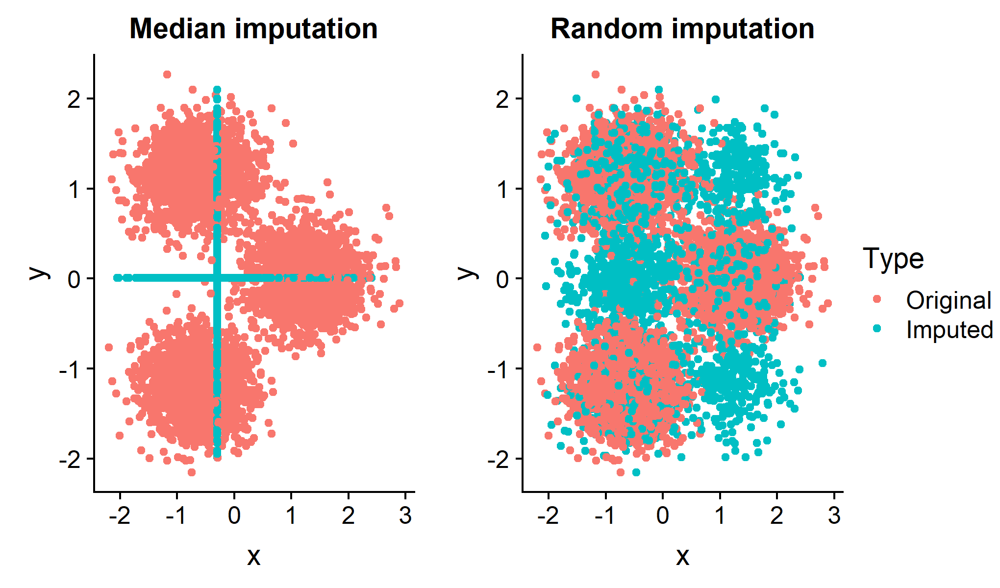
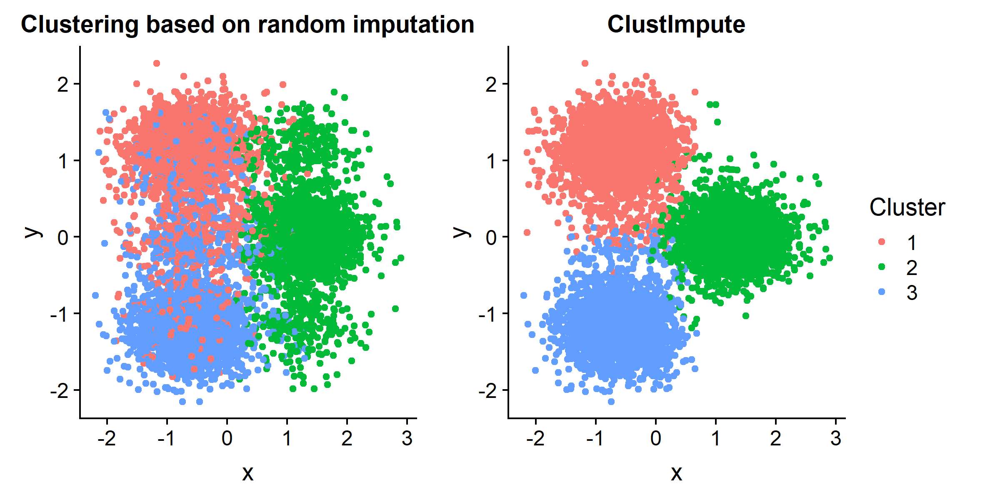

# ClustImpute

<!-- badges: start -->
[](https://travis-ci.org/o1iv3r/ClustImpute)
[](https://codecov.io/gh/o1iv3r/ClustImpute?branch=master)


<!-- badges: end -->


ClustImpute features a k-means clustering algorithm that includes a powerful iterative multiple missing data imputation method. Why is this relevant? Often a clustering based on median or random imputation will not provide good results even if we know the number of clusters. Both approaches badly distort the data set below and lead to bad clusters:



ClustImpute draws missing values iteratively based on the current cluster assignment so that correlations are considered. Subsequently, penalizing weights are imposed on imputed values and successively decreased (to zero) as the missing data imputation gets better.The algorithm is computationally efficient since the imputation is only as accurate as the clustering, and will be much faster than any approach that derives the full conditional missing distribution independently of the clustering.




## Installation

You can install the released version of ClustImpute with:

``` r
# install.packages("ClustImpute") # not on CRAN at the moment

# from github
devtools::install_github("o1iv3r/ClustImpute")
# ... including vignette
remotes::install_github("o1iv3r/ClustImpute", build = TRUE, build_opts = c("--no-resave-data", "--no-manual"),force=TRUE)
```

## Example

Using the default parameters ClustImpute can be used as follows

``` r
library(ClustImpute)
# X is a data frame
# nr_cluster is the number of clusters desired
ClustImpute(X,nr_cluster)
```

However, it is strongly advised to tune the other parameters. For a detailed example please refer to the vignette

``` r
vignette("Example_on_simulated_data")
```

## Details on ClustImpute

This clustering algorithm deals with missing data via weights that are imposed on missings and succesively increased. The hope is that at some point the observed point is near a cluster that provides a good neighborhood to draw the missing variable from. The algorithm is computationally efficient since the imputation is only as accurate as the clustering, and will be much faster than any approach that derives the full conditional missing distribution, e.g., as implemented in the MICE package.

In short, the algorithm follows these steps

1. It replaces all NAs by random imputation, i.e., for each variable with missings, it draws from the marginal distribution of this variable not taking into account any correlations with other variables
2. Weights <1 are used to adjust the scale of an observation that was generated in step 1. The weights are calculated by a (linear) weight function that starts near zero and converges to 1 at n_end.
3. A k-means clustering is performed with a number of c_steps steps starting with a random initialization.
4. The values from step 2 are replaced by new draws conditionally on the assign cluster from step 3.
5. Steps 2-4 are repeated nr_iter times in total. The k-means clustering in step 3 uses the previous cluster centroids for initialization.
6. After the last draws a final k-means clustering is performed.

The intuition is that observation should be clustered with other observations mainly based on their observed values, while the resulting clusters provide donors for the missing value imputation, so that subsequently all variables can be used for the clustering. 
